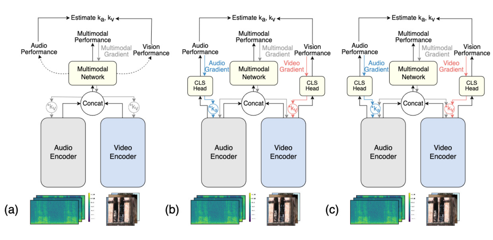
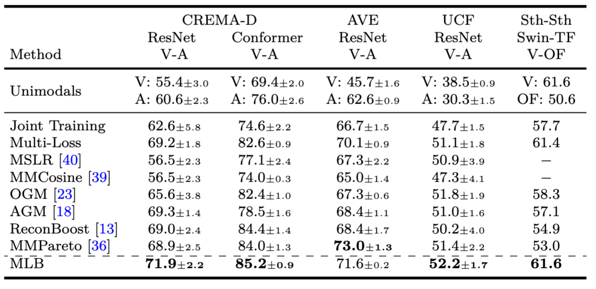
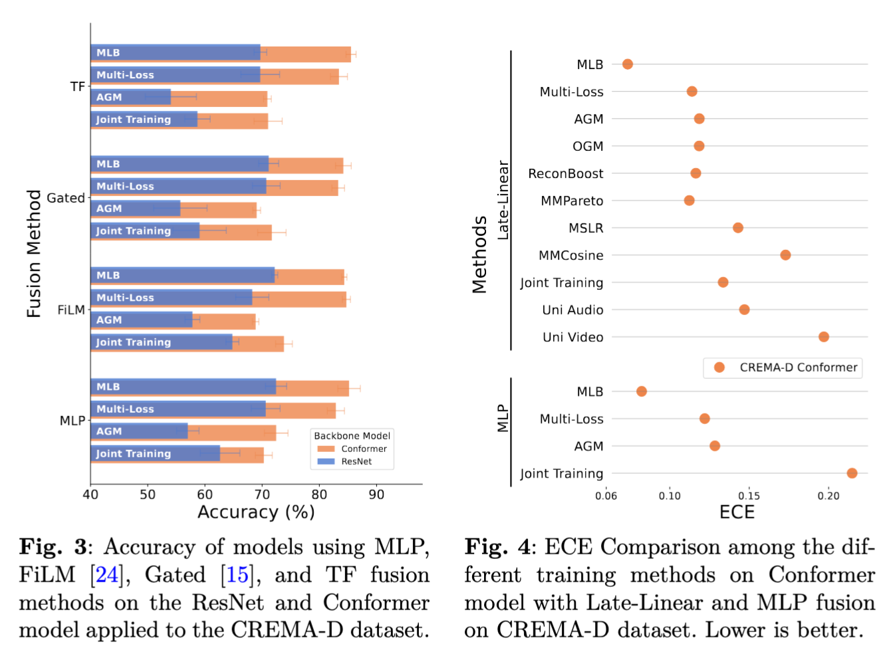
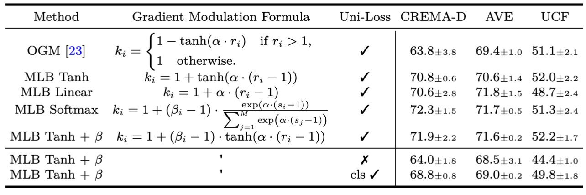

<div align="center">

# Multi-Loss Balanced (MLB)

Official implementation of the papers 

◉ #### Improving Multimodal Learning with Multi-Loss Gradient Modulation (BMVC 2024)
◉ #### Self-Balancing Multimodal Models via Multi-Loss Gradient Modulation (IJCV 2025)

</div>

---

[](https://www.springer.com/journal/)
[](https://bmvc2024.org/proceedings/977/)
[](https://arxiv.org/abs/2405.07930)
[](LICENSE)

<div align="center">
  <strong>
    <a href="https://kkontras.github.io/">Konstantinos Kontras</a><sup>1</sup>,
    <a href="https://www.kuleuven.be/wieiswie/nl/person/00126237">Christos Chatzichristos</a><sup>1</sup>,
    <a href="https://homes.esat.kuleuven.be/~mblaschk/">Matthew Blaschko</a><sup>1</sup>,
    <a href="https://www.kuleuven.be/wieiswie/nl/person/00050294">Maarten De Vos</a><sup>1,2</sup>
  </strong>
</div>
<div align="center">
  <sup>1</sup>Department of Electrical Engineering, KU Leuven, Leuven, Belgium <br>
  <sup>2</sup>Department of Development and Regeneration, KU Leuven, Leuven, Belgium
</div>

---

## TL;DR


Multimodal models often let one modality dominate training, hurting overall performance.  
We propose **Multi-Loss Gradient Modulation (MLB)**: a method that combines unimodal losses with adaptive gradient balancing.  
Unlike prior work, MLB can both **accelerate and decelerate** modality learning, and naturally phases out balancing at convergence.  

- Consistently outperforms state-of-the-art balancing methods across **audio-video (CREMA-D, AVE, UCF)** and **video-optical flow (Something-Something)** datasets  
- Works with **different backbones** (ResNet, Conformer) and **fusion strategies** (Late, Mid, FiLM, Gated, Transformer)  
- Improves **accuracy**, and **calibration**

---

## Method

The core idea of our Multi-Loss Balanced (MLB) method is illustrated below, in contrast with previous approaches:

- (a) Gradient Balancing Methods: These methods estimate unimodal performance to calculate coefficients (k_a, k_v) that are used to balance only the gradients from the main multimodal network.

- (b) Multi-Task Methods: These use separate unimodal classifiers (CLS Heads) to get better performance estimates, but they use the resulting coefficients to balance only the unimodal losses.

- (c) Proposed MLB Method: Our approach combines both strategies. It uses unimodal classifiers for accurate performance estimation and then uses these estimates to modulate the gradients for 

<div align="center">
  
</div>

The balancing coefficients are estimated as follows:
```math
\begin{align}
    s_i &= \sum_{j=1}^N \sum_{c=1}^Cf_i(X^j_i;\theta_{i})1_{k=y_{c}^j},\\ % \vspace{1mm}
    r_i &= \frac{\frac{1}{M-1}\sum_{m=1, m\neq i}^Ms_m}{s_i}, \\% \vspace{1mm}
    \beta_i &= \begin{cases} 
    \begin{aligned}
& \beta_{\mathrm{max}} \quad \text{if } r_i > 1,\\
& 2 \quad \text{otherwise},
\end{aligned}
\end{cases} \\% \vspace{1mm}
    k_i &= 1 + (\beta_i-1) \cdot \tanh(\alpha \cdot (r_i - 1)), 
    % k_i &= 1+\tanh(\alpha \cdot (r_i -1))
\end{align}
```

### Main Results

Table results demonstrate that MLB balances modality contributions more effectively, leading to consistent improvements across diverse multimodal domains.

<div align="center">
  
</div>

### Ablations

#### Fusion Methods & ECE

<div align="center">
  
</div>

#### Gradient Formulation Methods 

<div align="center">
  
</div>

## Repository Structure
```text
MLB/
│── agents/             
│   └── helpers/        # Evaluator, Loader, Trainer, Validator 
│── configs/            # Configuration files for each experiment + default configs
│── datasets/           # Datasets' loaders
│── figs/               # Figures & sample outputs
│── models/             # Model architectures
│── posthoc/            # Post-hoc Testing & Evaluation scripts
│── utils/              # Utility scripts
│── run.sh              # Shell script to launch training/testing
│── train.py            # Training entry point
│── show.py             # Showcasing trained models
│── requirements.txt    # Dependencies
└── README.md           # You are here
```

---

Training can be initiated via the command line. For example:
```bash
python train.py --config ./configs/CREMA_D/res/MLB.json  --default_config ./configs/default_config.json --fold 0 --lr 0.0001 --wd 0.0001 --alpha 1.5
```
You will find all the configurations used for each training in the `run.sh` file.

## Datasets

Our experiments evaluate MLB across diverse multimodal benchmarks.

| Dataset               | Modalities              | Task                                   | Link |
|------------------------|-------------------------|----------------------------------------|------|
| **CREMA-D**           | Video + Audio           | Emotion recognition                    | [CREMA-D](https://github.com/CheyneyComputerScience/CREMA-D) |
| **AVE**               | Video + Audio           | Action recognition        | [AVE](https://github.com/ysricuan/AVE-ECCV18) |
| **UCF**            | Video (+ Audio)         | Action recognition                     | [UCF101](https://www.crcv.ucf.edu/data/UCF101.php) |
| **CMU-MOSEI**         | Video + Audio + Text    | Sentiment & emotion analysis           | [MOSEI](https://github.com/A2Zadeh/CMU-MultimodalSDK) |
| **Something-Something v2** | Video + Optical Flow    | Fine-grained action recognition        | [Sth-Sth](https://20bn.com/datasets/something-something) |


## Contact

For feedback, questions, or collaboration opportunities, feel free to reach out at [konstantinos.kontras@kuleuven.be](mailto:konstantinos.kontras@kuleuven.be).

We welcome pull requests, issues, and discussions on this repository.

##  Citation

If you find our work inspiring or use our codebase in your research, please consider giving a star ⭐ and a citation.
```markdown
@inproceedings{kontras_2024_MLB,
author    = {Konstantinos Kontras and Christos Chatzichristos and Matthew B. Blaschko and Maarten De Vos},
title     = {Improving Multimodal Learning with Multi-Loss Gradient Modulation},
booktitle = {35th British Machine Vision Conference 2024, {BMVC} 2024, Glasgow, UK, November 25-28, 2024},
publisher = {BMVA},
year      = {2024},
url       = {https://papers.bmvc2024.org/0977.pdf}
}
```